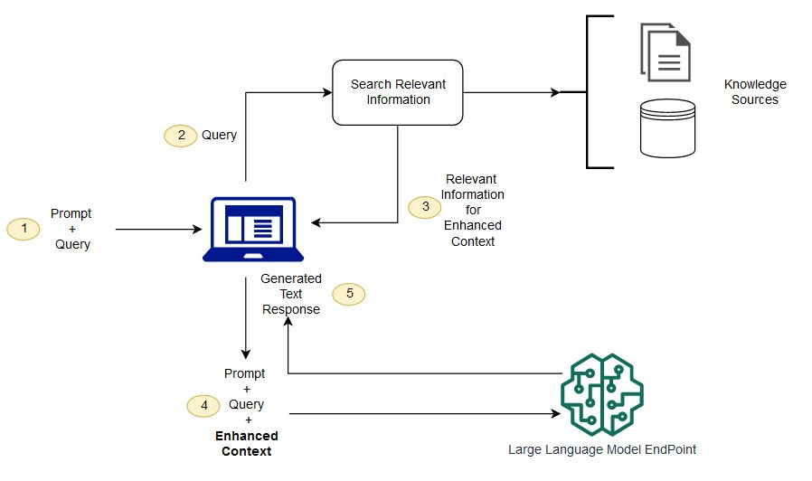

###RAG (Retrieval-Augmented Generation):

Retrieval-Augmented Generation (RAG) is the process of optimizing the output of a large language model, so it references an authoritative knowledge base outside of its training data sources before generating a response. Large Language Models (LLMs) are trained on vast volumes of data and use billions of parameters to generate original output for tasks like answering questions, translating languages, and completing sentences. RAG extends the already powerful capabilities of LLMs to specific domains or an organization's internal knowledge base, all without the need to retrain the model. It is a cost-effective approach to improving LLM output so it remains relevant, accurate, and useful in various contexts

##Why is Retrieval-Augmented Generation important?

LLMs are a key artificial intelligence (AI) technology powering intelligent chatbots and other natural language processing (NLP) applications. The goal is to create bots that can answer user questions in various contexts by cross-referencing authoritative knowledge sources.

Known challenges of LLMs include:

Presenting false information when it does not have the answer.
Presenting out-of-date or generic information when the user expects a specific, current response.
Creating a response from non-authoritative sources.
Creating inaccurate responses due to terminology confusion, wherein different training sources use the same terminology to talk about different things.
You can think of the Large Language Model as an over-enthusiastic new employee who refuses to stay informed with current events but will always answer every question with absolute confidence. Unfortunately, such an attitude can negatively impact user trust and is not something you want your chatbots to emulate!

RAG is one approach to solving some of these challenges. It redirects the LLM to retrieve relevant information from authoritative, pre-determined knowledge sources. Organizations have greater control over the generated text output, and users gain insights into how the LLM generates the response.

##What are the benefits of Retrieval-Augmented Generation?

-Cost-effective implementation
-Current information
-Enhanced user trust
-More developer control

##How does Retrieval-Augmented Generation work?
Without RAG, the LLM takes the user input and creates a response based on information it was trained on—or what it already knows. With RAG, an information retrieval component is introduced that utilizes the user input to first pull information from a new data source. The user query and the relevant information are both given to the LLM. The LLM uses the new knowledge and its training data to create better responses. The following sections provide an overview of the process.

-Create external data
-Retrieve relevant information
-Augment the LLM prompt
-Update external data

##What is the difference between Retrieval-Augmented Generation and semantic search?

Semantic search enhances RAG results for organizations wanting to add vast external knowledge sources to their LLM applications. Modern enterprises store vast amounts of information like manuals, FAQs, research reports, customer service guides, and human resource document repositories across various systems. Context retrieval is challenging at scale and consequently lowers generative output quality.

Semantic search technologies can scan large databases of disparate information and retrieve data more accurately. For example, they can answer questions such as, "How much was spent on machinery repairs last year?” by mapping the question to the relevant documents and returning specific text instead of search results. Developers can then use that answer to provide more context to the LLM.

Conventional or keyword search solutions in RAG produce limited results for knowledge-intensive tasks. Developers must also deal with word embeddings, document chunking, and other complexities as they manually prepare their data. In contrast, semantic search technologies do all the work of knowledge base preparation so developers don't have to. They also generate semantically relevant passages and token words ordered by relevance to maximize the quality of the RAG payload.